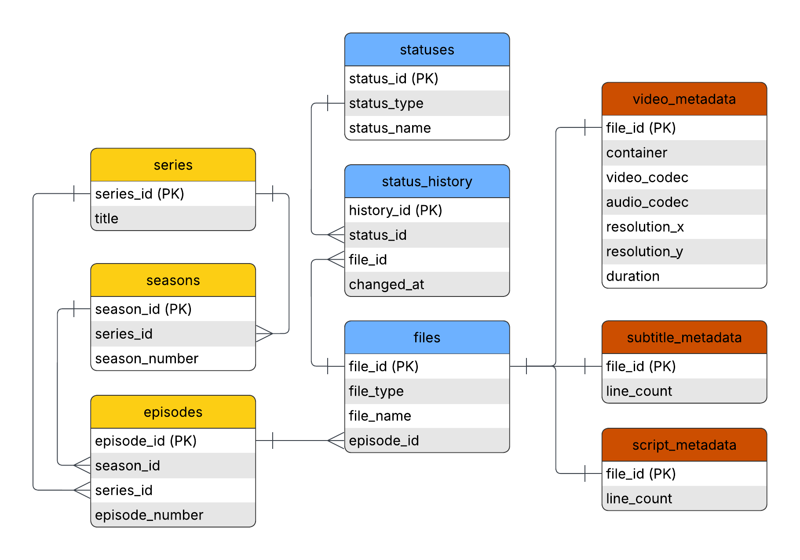

# Fansubbing Workflow Database

A comprehensive relational database system analyzing donghua (Chinese animation) fansubbing workflows, revealing significant production irregularities compared to standardized anime production.

## 🎯 Project Highlights

- **Real-world Data**: Analysis of 80+ episodes from actual fansubbing workflows
- **Production Insights**: Discovered extreme variability (8-24 episodes per season, 30+ minute runtime differences)
- **Technical Implementation**: 8-table normalized SQLite database with advanced SQL analysis
- **Workflow Analysis**: Quantified resource allocation challenges in volunteer translation communities

## 📊 Key Findings

- **Production Variability**: Episode counts vary from 8-24 per season with runtime fluctuations of 14:54-43:48 minutes
- **Technical Challenges**: Non-standardized video resolutions require constant subtitle script adjustments
- **Resource Constraints**: Only 24 of 80 episodes received revisions, some taking 4+ years between completion and first revision
- **Industry Impact**: Results demonstrate why donghua fansubbing faces unique challenges compared to anime fansubbing

## 🚀 Quick Start

1. **Prerequisites**: R with `knitr`, `tidyverse`, `fs`, `DBI`, `RSQLite`, `RMariaDB` packages
2. **Run Analysis**: Open `analysis/fansub_demo.Rmd` in RStudio and knit
3. **Explore Database**: Use queries from `src/fansub_queries.sql` with the SQLite database
4. **View Results**: Check `analysis/fansub_demo.pdf` for full report

## 📁 Project Structure

```
├── src/                        # Source code and data
│   ├── fansub_db_init.R        # Database initialization script
│   ├── fansub_export.R         # Data extraction script
│   ├── fansub_queries.sql      # SQL queries collection
│   └── data/                   # Data files
│       ├── subtitles.csv       # Subtitle metadata
│       ├── timings.csv         # Episode timing data
│       ├── translations.csv    # Translation status tracking
│       └── video_metadata.csv  # Video technical specifications
├── analysis/                   # Analysis and results
│   ├── fansub_demo.Rmd         # Main analysis (R Markdown)
│   ├── fansub_demo.pdf         # Generated report
│   ├── fansub_schema.png       # Database schema diagram
│   └── subbing.db              # SQLite database
├── fansubbing-database.qmd     # Project overview (Quarto)
└── README.md                   # This file
```

## 🛠️ Technical Implementation

- **Database**: SQLite with 8 normalized tables tracking series, episodes, subtitles, and metadata
- **Analysis**: R with advanced SQL queries (CTEs, window functions, complex joins)
- **Data Pipeline**: Automated metadata extraction using R and ffprobe from ffmpeg toolkit
- **Visualization**: ggplot2 for production pattern analysis and workflow insights

## 📖 Database Schema

The database tracks:
- **Series & Episodes**: Hierarchical organization of donghua content across seasons
- **Subtitle Files**: Status tracking and version management for translation workflow
- **Video Metadata**: Technical specifications extracted via ffprobe automation
- **Workflow Status**: Production stages and completion tracking with historical data



## 🎬 About the Data

This project uses real production data from donghua fansubbing workflows managed by "odspro" in the donghua fansub community. The analysis reveals how inconsistent donghua production patterns create unique workflow challenges for volunteer translators compared to standardized anime production cycles.

### Data Sources
- Episode metadata extracted using automated R scripts
- Video technical specifications via ffprobe command-line interface accessed through R's `fs` package
- Subtitle timing and status data from actual fansubbing projects
- Translation workflow tracking across multiple donghua series

## 📋 Sample Analysis Queries

The full demo includes six comprehensive SQL queries analyzing real fansubbing workflow data:

- **Query 1**: Identifies episodes missing subtitle files across all series
- **Query 2**: Tracks the 10 most recent status updates for subtitle files
- **Query 3**: Analyzes video resolution progression throughout seasons
- **Query 4**: Examines correlation between subtitle line counts and video durations
- **Query 5**: Analyzes episode duration patterns and identifies outliers
- **Query 6**: Measures time delays between subtitle completion and first revision

## 🔗 Links

- [Full Project Report](analysis/fansub_demo.pdf)
- [Database Schema Diagram](analysis/fansub_schema.png)
- [SQL Queries Collection](src/fansub_queries.sql)
- [Project Overview](https://oliversiu.netlify.app/projects/project_05/project_05)

## 🌟 Project Context

This project was developed as a personal database design project, showcasing:
- Relational database normalization and design principles
- Complex SQL query development and optimization
- Real-world data analysis and insight generation
- Automated data extraction and processing workflows

The project demonstrates how database systems can provide valuable insights into volunteer-driven creative workflows, revealing production patterns and resource challenges in fan translation communities.

---

*This project demonstrates database design, SQL expertise, and data analysis skills through real-world workflow management challenges in media translation. Built by Oliver D Siu (odspro) as a personal project exploring fansubbing workflow optimization.*
